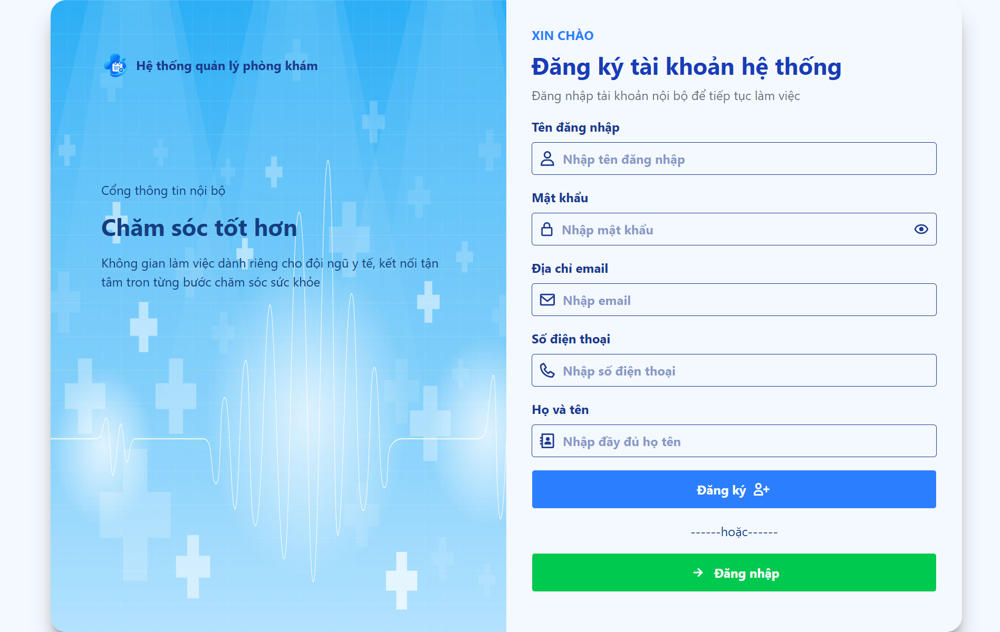
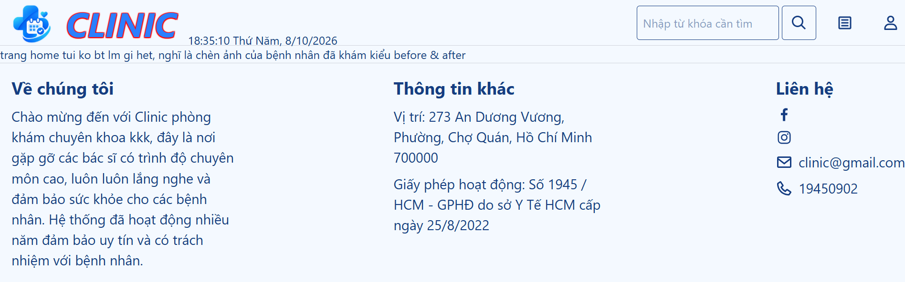

# Clinic Management System

## Build Windows releases

Requirements: Windows, Git, and a current Node.js LTS release with npm.

```powershell
git clone https://github.com/DinoTang/clinic-management-system.git
cd clinic-management-system\_frontend
npm ci
```

Build the Clinic Management installer:

```powershell
npm run electron:build
```

Build the MediGo installer:

```powershell
npm run electron:build:mobile
```

Build both installers:

```powershell
npm run electron:build:all
```

Installers are written to `_frontend/release/` and
`_frontend/release-mobile/`. These scripts create **Windows `.exe` installers**;
they do not create an Android APK. Release files and `node_modules` are generated
locally and must not be committed.

# Screenshot giao diện

**Trang đăng nhập (login)**


**Trang đăng ký (register)**




**Trang chủ (home)**




